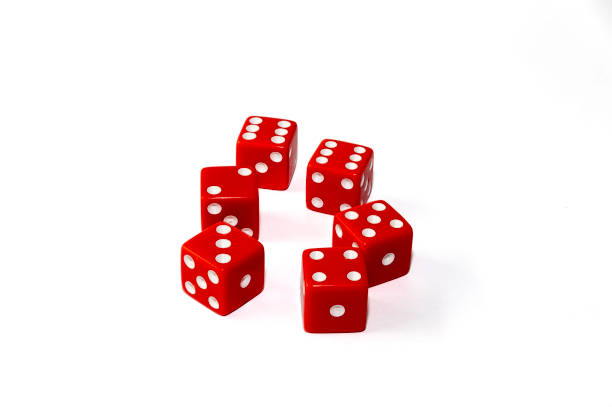
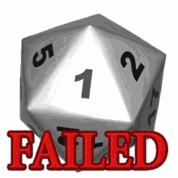
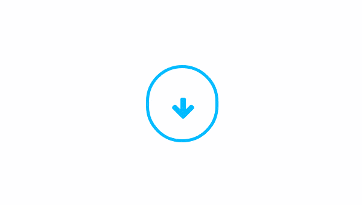
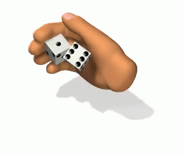
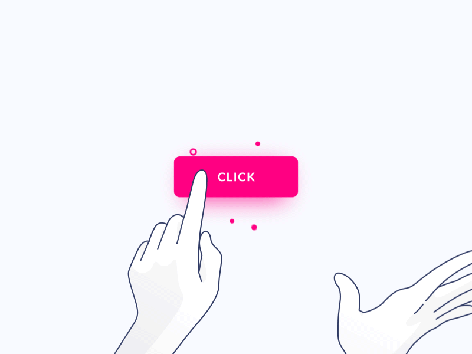
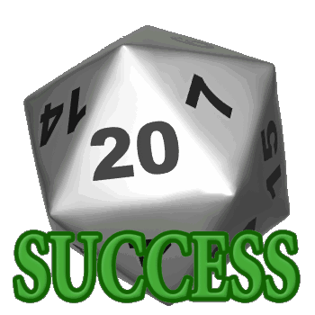

# PIG DICE    :pig:
-----------------
**Created by Tony Kihara**
------------------
## DESCRIPTION :message:
 ~~~
 It is a game that mainly entails rolling of dices among two parties.
 It record  the highest points of one player and declares him/her the winner.
 It is addictive and it can be played by anyone both adults and children.
 ~~~
------------------------------------
## FEATURES
The main features used in making of the games is:
* images:
                
                    
                     
        
* The languages used in the game are:
    -[HTML](https://www.w3schools.com/html/)
    -[CSS](https://www.w3schools.com/css/css_intro.asp)
    -[Javascript](https://javascript.info/)
------------------------------------------------------------------
## INSTRUCTION OF USE
To use the codes of the game:
~~~~
$ git clone https://github.com/Kihara-tony/Pig-dice.git
$ atom .
~~~~
## BDD
|Behavoir|input|output|
|------:|------:|-----:|
|To show your name|Tony|Player Tony|
|To add up the digits|roll=3|total=9|
|To show the winner|After three attempts each|Tony you won|

------------------------------
## CONTACT
To reach me use the contacts below:
~~~
* Email:tonykiharatonkin6@gmail.com
* Call: 0748963275
~~~
----------------------------------------
## LISENCE
Copyright 2019 Tony Kihara.

Permission is hereby granted, free of charge, to any person obtaining a copy of this software and associated documentation files (the "Software"), to deal in the Software without restriction, including without limitation the rights to use, copy, modify, merge, publish, distribute, sublicense, and/or sell copies of the Software, and to permit persons to whom the Software is furnished to do so, subject to the following conditions:

The above copyright notice and this permission notice shall be included in all copies or substantial portions of the Software.

THE SOFTWARE IS PROVIDED "AS IS", WITHOUT WARRANTY OF ANY KIND, EXPRESS OR IMPLIED, INCLUDING BUT NOT LIMITED TO THE WARRANTIES OF MERCHANTABILITY, FITNESS FOR A PARTICULAR PURPOSE AND NONINFRINGEMENT. IN NO EVENT SHALL THE AUTHORS OR COPYRIGHT HOLDERS BE LIABLE FOR ANY CLAIM, DAMAGES OR OTHER LIABILITY, WHETHER IN AN ACTION OF CONTRACT, TORT OR OTHERWISE, ARISING FROM, OUT OF OR IN CONNECTION WITH THE SOFTWARE OR THE USE OR OTHER DEALINGS IN THE SOFTWARE.
